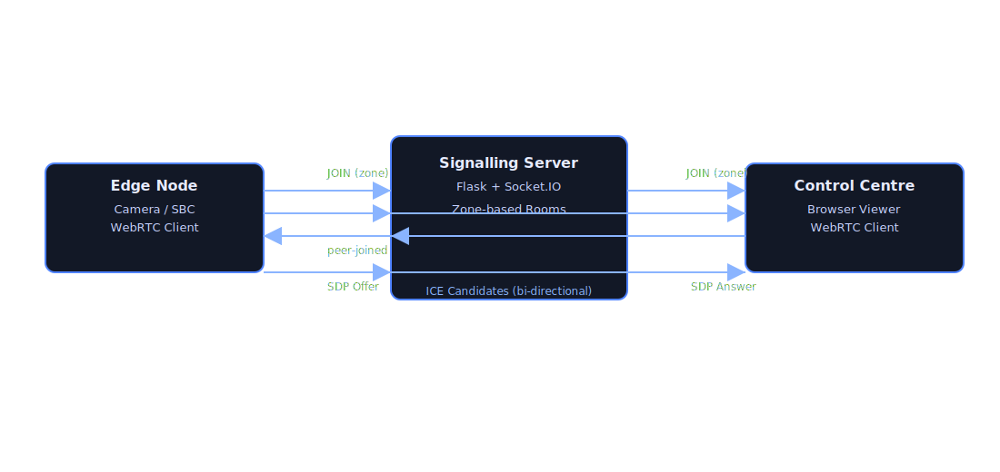
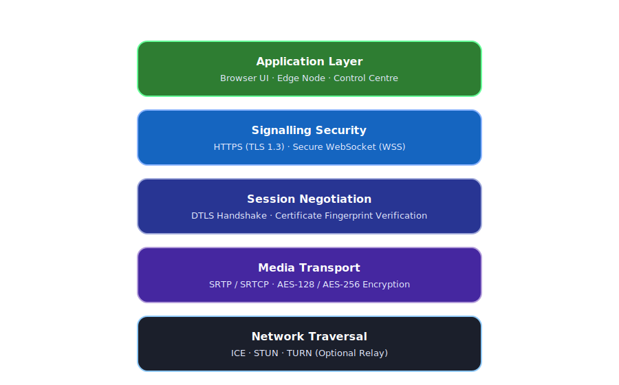
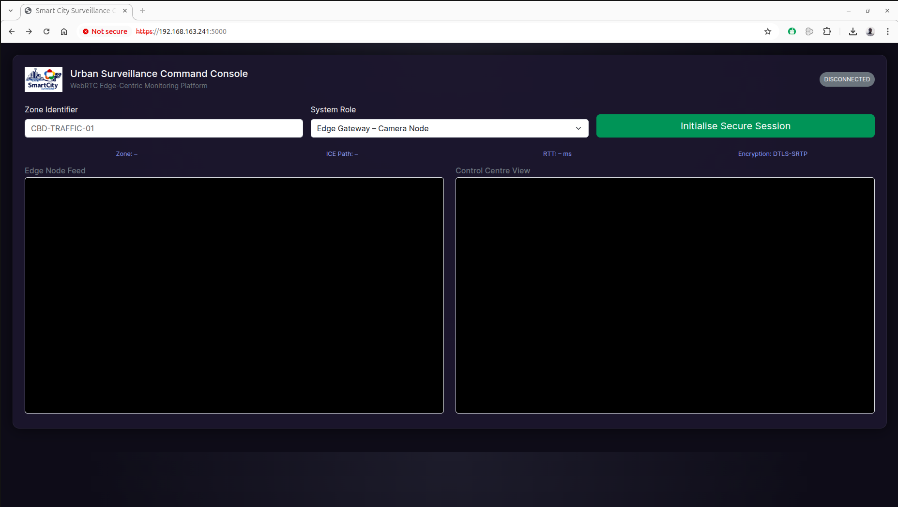

# Smart City WebRTC Surveillance 

<p align="center">
  
</p>

A decentralised IoT surveillance gateway using WebRTC for ultra-low-latency, secure, browser-native live video preview in smart city environments. The system combines peer-to-peer media delivery with a lightweight Flask–Socket.IO signalling plane and edge-based intelligence.

[](https://opensource.org/licenses/BSD-3-Clause)
[](https://www.python.org/downloads/)
[](https://flask.palletsprojects.com/)

## Features

- **🚀 Ultra-Low Latency**: WebRTC peer-to-peer streaming with <100ms latency
- **🔒 Secure by Design**: DTLS-SRTP encrypted media streams, HTTPS/WSS signalling
- **🌐 Browser-Native**: Zero plugin requirements, works in any modern browser
- **⚡ Edge Computing**: Lightweight signalling server for distributed deployments
- **🏙️ Smart City Ready**: Scalable architecture for multi-zone surveillance
- **📱 Real-Time**: Socket.IO for instant peer connection signalling

## Architecture

```
┌─────────────┐         ┌──────────────┐         ┌─────────────┐
│   Camera    │◄───────►│   Signaling  │◄───────►│  Dashboard  │
│  (Browser)  │  Socket │    Server    │  Socket │  (Browser)  │
│             │   .IO   │ Flask+SocketIO│   .IO  │             │
└─────────────┘         └──────────────┘         └─────────────┘
       │                                                  │
       └──────────────────────────────────────────────────┘
                    WebRTC P2P Media Stream
                      (DTLS-SRTP Encrypted)
```

### Signaling Flow

<p align="center">
  
</p>

### Security Stack

<p align="center">
  
</p>

## Prerequisites

- Python 3.8 or higher
- Modern web browser (Chrome, Firefox, Safari, Edge)
- SSL certificate (self-signed or CA-issued)
- Webcam or IP camera (for streaming)

## Getting Started

### 1. Clone the Repository

```bash
git clone https://github.com/imosudi/smartcity-webrtc-surveillance.git
cd smartcity-webrtc-surveillance
```

### 2. Create Python Virtual Environment

```bash
# Create virtual environment
python3 -m venv venv

# Or on some systems
python -m venv venv
```

### 3. Activate Virtual Environment

**Linux/macOS:**
```bash
source venv/bin/activate
```

**Windows:**
```bash
# Command Prompt
venv\Scripts\activate.bat

# PowerShell
venv\Scripts\Activate.ps1
```

### 4. Install Dependencies

```bash
pip install -r requirements.txt
```

### 5. Configure SSL Certificates

WebRTC requires HTTPS for security. Generate a self-signed certificate for testing:

```bash
# Generate self-signed certificate (valid for 365 days)
openssl req -x509 -newkey rsa:4096 -nodes \
  -keyout key.pem -out cert.pem -days 365 \
  -subj "/CN=localhost"
```

**Important**: Update the certificate paths in `app.py`:

```python
certfile="/path/to/your/cert.pem",
keyfile="/path/to/your/key.pem",
```

### 6. Run the Application

```bash
python app.py
```

You should see output like:

```
==================================================
 WebRTC Surveillance Server Starting...
==================================================
🖥️  Hostname: your-hostname
📍 Listening: 0.0.0.0:5000

🌐 Access URLs:
   • https://localhost:5000
   • https://192.168.1.100:5000

🔒 SSL: Enabled
🔄 WebSocket: Ready
==================================================
```

### 7. Access the Dashboard

Open your browser and navigate to one of the URLs shown above:

```
https://localhost:5000
```

**Note**: You may see a security warning for self-signed certificates. Click "Advanced" and proceed to continue.

## 📱 Usage

### Edge Gateway – Camera Node (Publisher)

1. Open the Urban Surveillance Command Console in your browser
2. Enter a **Zone Identifier** (e.g., `CBD-TRAFFIC-01`, `PARK-WEST-02`)
3. Select **"Edge Gateway – Camera Node"** as the System Role
4. Click **"Initialise Secure Session"**
5. Allow camera permissions when prompted by the browser
6. The local video feed will appear in the "Edge Node Feed" panel
7. Monitor connection status in the top-right status pill (CONNECTED/STREAMING)

### Control Centre – Operator (Subscriber)

1. Open the dashboard in another browser window/device/location
2. Enter the **same Zone Identifier** as the camera node
3. Select **"Control Centre – Operator"** as the System Role
4. Click **"Initialise Secure Session"**
5. The live feed will appear automatically in the "Control Centre View" panel
6. View real-time metrics: ICE connection path, RTT latency, and encryption status

### Dashboard Features

The console displays real-time Key Performance Indicators (KPIs):
- **Zone**: Currently monitored surveillance zone
- **ICE Path**: WebRTC connection type (host/srflx/relay)
- **RTT**: Round-trip time latency in milliseconds
- **Encryption**: Always shows DTLS-SRTP (secure encrypted stream)



## 🚀 Production Deployment

### Running as a System Service

For production environments, run the application as a systemd service:

```bash
# Copy the service file
sudo cp deployment/systemd.service /etc/systemd/system/smartcity-surveillance.service

# Edit paths in the service file
sudo nano /etc/systemd/system/smartcity-surveillance.service

# Enable and start the service
sudo systemctl enable smartcity-surveillance
sudo systemctl start smartcity-surveillance

# Check status
sudo systemctl status smartcity-surveillance
```

### Nginx Reverse Proxy

Use Nginx as a reverse proxy for load balancing and additional security:

```bash
# Copy Nginx configuration
sudo cp deployment/nginx.conf /etc/nginx/sites-available/smartcity-surveillance

# Create symbolic link
sudo ln -s /etc/nginx/sites-available/smartcity-surveillance /etc/nginx/sites-enabled/

# Test configuration
sudo nginx -t

# Restart Nginx
sudo systemctl restart nginx
```

### TURN Server (Optional)

For NAT traversal in complex network topologies, deploy a TURN server using Coturn:

```bash
# Install Coturn
sudo apt install coturn

# Copy configuration
sudo cp deployment/coturn.conf /etc/turnserver.conf

# Edit configuration with your credentials and realm
sudo nano /etc/turnserver.conf

# Enable and start Coturn
sudo systemctl enable coturn
sudo systemctl start coturn
```

Update your WebRTC configuration in `surveillance.js` to use the TURN server:

```javascript
const iceServers = [
    { urls: 'stun:stun.l.google.com:19302' },
    { 
        urls: 'turn:your-turn-server.com:3478',
        username: 'your-username',
        credential: 'your-password'
    }
];
```

## 🔧 Configuration

### Port Configuration

Edit `app.py` to change the default port:

```python
socketio.run(
    app,
    host="0.0.0.0",
    port=5000,  # Change this
    ssl_context=ssl_context,
    debug=False
)
```

### CORS Settings

Modify allowed origins in `app.py`:

```python
socketio = SocketIO(
    app,
    cors_allowed_origins="*",  # Change for production
    async_mode="gevent"
)
```

### Zone Management

Zones are dynamically defined through the **Zone Identifier** field in the dashboard. Multiple surveillance areas can be monitored simultaneously by:

1. **Creating Zone Identifiers**: Use descriptive names following a naming convention:
   - Format: `LOCATION-TYPE-NUMBER`
   - Examples: `CBD-TRAFFIC-01`, `PARK-WEST-02`, `STATION-NORTH-05`

2. **Multi-Zone Deployment**: Deploy multiple edge gateways across different zones, each with unique identifiers

3. **Operator Assignment**: Control centre operators can monitor different zones by switching the Zone Identifier field

### Dashboard Customization

The Urban Surveillance Command Console is built with:
- **Bootstrap 5.3.3**: Modern, responsive UI framework
- **Socket.IO 4.7.2**: Real-time bidirectional communication
- **Custom CSS**: Dark theme optimized for 24/7 monitoring environments

To customize the dashboard appearance, edit `templates/dashboard.html`:

```html
<!-- Change logo -->


<!-- Modify color scheme -->
<style>
body {
    background: radial-gradient(circle at top, #1c1f2b 0%, #0d0f18 60%);
}
</style>
```

## Project Structure

```
smartcity-webrtc-surveillance/
├── app.py                          # Main Flask application & signaling server
├── requirements.txt                # Python dependencies
├── LICENSE                         # BSD-3-Clause license
├── README.md                       # This file
│
├── certs/                          # SSL/TLS certificates
│   ├── cert.pem                    # SSL certificate (you generate)
│   └── key.pem                     # SSL private key (you generate)
│
├── templates/                      # Frontend templates
│   └── dashboard.html              # Urban Surveillance Command Console UI
│
├── static/                         # Static assets
│   ├── images/                     # Logos and graphics
│   │   ├── smarc_city_logo_wh.png # Dashboard logo (white)
│   │   └── smart_city_logo.png    # Alternative logo
│   └── surveillance.js             # WebRTC client-side logic
│
├── docs/                           # Documentation diagrams
│   ├── architecture.svg            # System architecture diagram
│   ├── signalling-flow.svg         # WebSocket signaling sequence
│   ├── svgviewer-output.svg        # Main README banner
│   └── webrtc-security-stack.svg   # Security layer visualization
│
├── doc/                            # Additional assets
│   ├── smarc_city_logo_wh.png     # Brand assets
│   ├── smarc_city_logo.png
│   └── svgviewer-output.svg
│
├── screenshots/                    # Application screenshots
│   └── live-preview.png           # Dashboard in action
│
├── deployment/                     # Production deployment configs
│   ├── coturn.conf                # TURN server configuration
│   ├── nginx.conf                 # Reverse proxy setup
│   └── systemd.service            # Linux service unit file
│
└── notes/                          # Development documentation
    └── smart-city-architecture.md # Architecture notes
```

### Key Components

#### Core Application
- **`app.py`**: Flask-SocketIO server handling WebSocket signaling (offer/answer/ICE candidates)
- **`dashboard.html`**: Responsive web interface with dual video panels and real-time KPI metrics
- **`surveillance.js`**: WebRTC peer connection management, media streaming, and Socket.IO event handlers

#### Security
- **`certs/`**: SSL/TLS certificates directory (required for HTTPS/WSS secure connections)
- **`deployment/coturn.conf`**: TURN server configuration for NAT traversal in production

#### Deployment
- **`deployment/nginx.conf`**: Nginx reverse proxy configuration for load balancing
- **`deployment/systemd.service`**: Systemd unit file for running as a Linux service

#### Documentation
- **`docs/`**: SVG diagrams for architecture, signaling flow, and security stack
- **`screenshots/`**: Visual demonstrations of the platform in operation

## 🛠️ Dependencies

Core libraries powering the surveillance gateway:

- **Flask** (2.3+): Lightweight WSGI web framework
- **Flask-SocketIO** (5.3+): WebSocket communication layer for signaling
- **gevent** (23.9+): Coroutine-based async networking library
- **gevent-websocket** (0.10+): WebSocket support for gevent workers
- **python-socketio**: Socket.IO protocol implementation

Frontend technologies:

- **Bootstrap 5.3.3**: Responsive UI framework
- **Socket.IO Client 4.7.2**: Real-time bidirectional event-based communication
- **WebRTC API**: Native browser peer-to-peer media streaming

See `requirements.txt` for the complete dependency list with version pinning.

## 🔒 Security Considerations

### Production Deployment

1. **Use Valid SSL Certificates**: Replace self-signed certificates with CA-issued ones
   ```bash
   # Using Let's Encrypt (recommended)
   sudo certbot certonly --standalone -d yourdomain.com
   ```

2. **Restrict CORS**: Change `cors_allowed_origins="*"` to specific trusted domains
   ```python
   socketio = SocketIO(
       app,
       cors_allowed_origins=["https://yourdomain.com", "https://control.yourdomain.com"],
       async_mode="gevent"
   )
   ```

3. **Add Authentication**: Implement user authentication before accessing streams
   - Consider Flask-Login for session management
   - Add API keys for edge gateway authentication
   - Implement role-based access control (RBAC)

4. **Zone Access Control**: Restrict which operators can view specific zones
   ```python
   # Example: Add zone authorization middleware
   @socketio.on("join")
   def join(data):
       if not user_authorized_for_zone(current_user, data["zone"]):
           return {"error": "Unauthorized"}
       join_room(data["zone"])
   ```

5. **Firewall Rules**: Only expose necessary ports
   ```bash
   # Example UFW rules (Ubuntu)
   sudo ufw allow 5000/tcp  # HTTPS
   sudo ufw enable
   ```

6. **Rate Limiting**: Prevent abuse and DoS attacks
   ```python
   from flask_limiter import Limiter
   limiter = Limiter(app, key_func=get_remote_address)
   ```

7. **Update Dependencies**: Regularly update packages for security patches
   ```bash
   pip install --upgrade -r requirements.txt
   ```

8. **Logging & Monitoring**: Implement audit trails for surveillance access
   ```python
   import logging
   logging.info(f"Zone {zone} accessed by {user} at {timestamp}")
   ```

### Privacy Compliance

⚠️ **Important**: When deploying surveillance systems, ensure compliance with:
- GDPR (EU) - Data protection and privacy regulations
- Local surveillance laws and public notification requirements
- Data retention policies and access logs
- Privacy impact assessments for public spaces

## 🐛 Troubleshooting

### SSL Certificate Errors

```bash
# Browser shows "Your connection is not private"
# Solution: Accept the self-signed certificate or use a valid CA certificate
```

### Camera Not Accessible

```bash
# Error: "Permission denied" or "Camera not found"
# Solutions: 
# 1. Ensure HTTPS is enabled (WebRTC requires secure context)
# 2. Grant camera permissions in browser settings
# 3. Check if another app is using the camera
# 4. Verify camera is selected in browser's device picker
# 5. Try a different browser (Chrome/Firefox recommended)
```

### Video Feed Not Appearing

```bash
# Remote video panel shows black screen
# Solutions:
# 1. Verify both peers are using the SAME Zone Identifier
# 2. Check browser console for WebRTC errors (F12 → Console)
# 3. Ensure both devices are on accessible networks (not behind symmetric NAT)
# 4. Check firewall/router allows UDP ports for WebRTC
# 5. Monitor the status pill - should show "CONNECTED" or "STREAMING"
```

### High Latency / Poor Quality

```bash
# RTT shows >500ms or video stutters
# Solutions:
# 1. Check network bandwidth (WebRTC adapts but needs minimum 1-2 Mbps)
# 2. Reduce distance between peers if possible
# 3. Check ICE Path metric - "relay" indicates TURN server routing (higher latency)
# 4. Close other bandwidth-intensive applications
# 5. Consider deploying TURN server for relay optimization
```

### Connection Issues

```bash
# Cannot connect to server
# Solution:
# 1. Check firewall rules
# 2. Verify the server is running
# 3. Ensure you're using HTTPS, not HTTP
# 4. Check the correct IP address/port
```

### Port Already in Use

```bash
# Error: "Address already in use"
# Solution: Change the port in app.py or kill the process using port 5000
lsof -ti:5000 | xargs kill -9  # Linux/macOS
```

## 🤝 Contributing

Contributions are welcome! Please feel free to submit a Pull Request.

1. Fork the repository
2. Create your feature branch (`git checkout -b feature/AmazingFeature`)
3. Commit your changes (`git commit -m 'Add some AmazingFeature'`)
4. Push to the branch (`git push origin feature/AmazingFeature`)
5. Open a Pull Request

## 📄 License

This project is licensed under the BSD 3-Clause License - see the [LICENSE](LICENSE) file for details.

## 📧 Contact

Project Link: [https://github.com/imosudi/smartcity-webrtc-surveillance](https://github.com/imosudi/smartcity-webrtc-surveillance)

## 🙏 Acknowledgments

- WebRTC API for real-time communication
- Flask and Socket.IO communities
- Smart city IoT research initiatives

---

**⚠️ Disclaimer**: This software is provided for educational and research purposes. Ensure compliance with local surveillance and privacy laws when deploying in production environments.